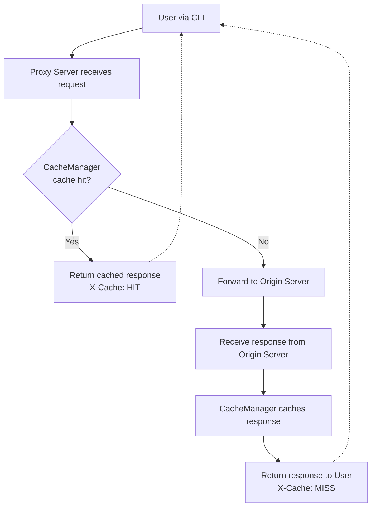

# CacheFlow

Caching proxy server

```mermaid
flowchart TD
    U[User via CLI] --> P[Proxy Server receives request]
    P --> C{CacheManager<br>cache hit?}
    C -- Yes --> R1[Return cached response<br>X-Cache: HIT]
    C -- No  --> O[Forward to Origin Server]
    O --> S[Receive response from Origin Server]
    S --> CM[CacheManager caches response]
    CM --> R2[Return response to User<br>X-Cache: MISS]

    %% Visualize final return path
    R1 -.-> U
    R2 -.-> U
```
