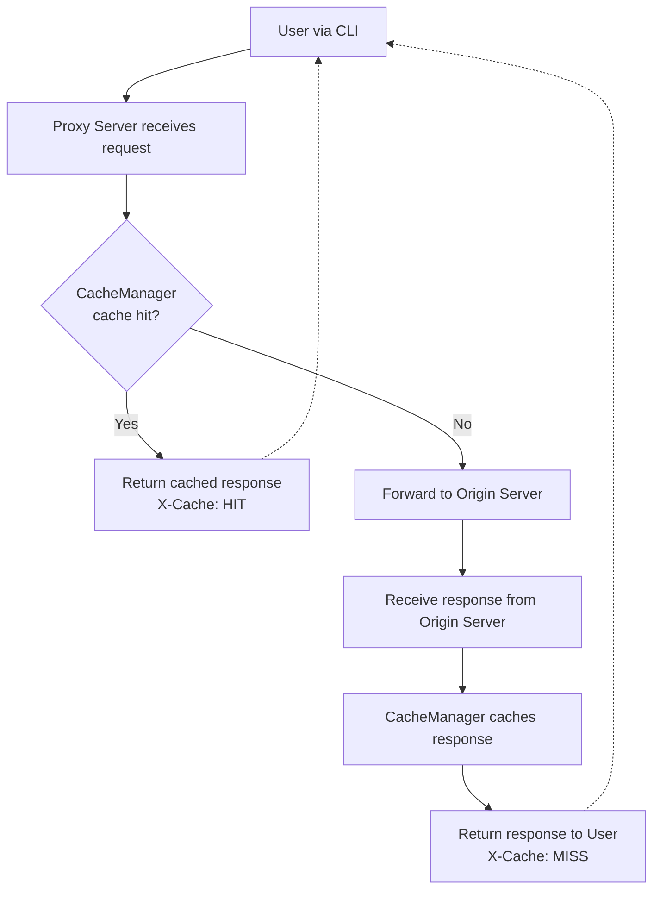

# CacheFlow

A high-performance CLI caching proxy server that forwards requests to origin servers and caches responses for improved performance. When the same request is made again, CacheFlow returns the cached response instead of forwarding to the origin server.

## Demo


## Architecture




## Features

- **🚀 High Performance**: In-memory caching for lightning-fast response times
- **🔄 Smart Caching**: Automatically caches responses and serves cached data on subsequent requests
- **📊 Cache Headers**: Adds `X-Cache: HIT/MISS` headers to track cache performance
- **🛠️ CLI Interface**: Easy-to-use command-line interface with flexible configuration
- **🧹 Cache Management**: Built-in cache clearing functionality
- **⚡ Express.js Powered**: Built on Express.js for reliability and extensibility
- **📝 TypeScript**: Fully typed for better development experience

## Installation

### Prerequisites

- Node.js (v16 or higher)
- npm or yarn

### Install from source

```bash
# Clone the repository
git clone https://github.com/gazzaar/CacheFlow.git
cd CacheFlow

# Install dependencies
npm install

# Build the project
npm run tsc

# Install globally (optional)
npm link
```

## Usage

### Basic Usage

Start the caching proxy server with default settings:

```bash
caching-proxy -o http://api.example.com -p 3000
```

### Command Line Options

| Option          | Short | Description                            | Required |
| --------------- | ----- | -------------------------------------- | -------- |
| `--origin`      | `-o`  | Origin server URL to proxy requests to | Yes      |
| `--port`        | `-p`  | Port number for the proxy server       | Yes      |
| `--clear-cache` | `-c`  | Clear the cache and exit               | No       |

### Examples

#### Proxy to a REST API

```bash
caching-proxy -o https://jsonplaceholder.typicode.com -p 8080
```

#### Proxy to a local development server

```bash
caching-proxy -o http://localhost:3001 -p 8080
```

#### Clear cache

```bash
caching-proxy --clear-cache
```

### Making Requests

Once the proxy server is running, you can make requests to it:

```bash
# The proxy will forward this to the origin server and cache the response
curl http://localhost:8080/posts/1

# Subsequent requests to the same endpoint will be served from cache
curl http://localhost:8080/posts/1
```

### Cache Headers

The proxy server adds an `X-Cache` header to responses:

- `X-Cache: HIT` - Response was served from cache
- `X-Cache: MISS` - Response was fetched from origin server and cached

## Development

### Project Structure

```
CacheFlow/
├── src/
│   ├── cli.ts          # Command-line interface
│   ├── index.ts        # Server startup logic
│   ├── proxyServer.ts  # Main proxy server implementation
│   ├── cacheManager.ts # Cache management utilities
│   ├── types.ts        # TypeScript type definitions
│   └── util/
│       └── validateArgument.ts # Input validation
├── docs/
│   └── caching-proxy-server.png
└── package.json
```

### Available Scripts

```bash
# Development with hot reload
npm run dev

# Build TypeScript to JavaScript
npm run tsc

# Lint code
npm run lint

# Start production server
npm start
```

### Technology Stack

- **Runtime**: Node.js
- **Framework**: Express.js
- **Language**: TypeScript
- **HTTP Client**: Axios
- **CLI Framework**: Commander.js
- **Caching**: In-memory Map

## How It Works

1. **Request Reception**: The proxy server receives HTTP requests from clients
2. **Cache Check**: It checks if the requested URL exists in the cache
3. **Cache Hit**: If found, returns the cached response with `X-Cache: HIT`
4. **Cache Miss**: If not found, forwards the request to the origin server
5. **Response Caching**: Stores the origin server's response in memory
6. **Response Return**: Returns the response to the client with `X-Cache: MISS`

## Performance Benefits

- **Reduced Latency**: Cached responses are served instantly
- **Bandwidth Savings**: Reduces requests to origin servers
- **Load Reduction**: Decreases load on origin servers
- **Improved User Experience**: Faster response times for repeated requests

## TODO

- [ ] Add TTL
- [ ] redis

## License

This project is licensed under the MIT License

## Project URL

- [caching-server](https://roadmap.sh/projects/caching-server)
